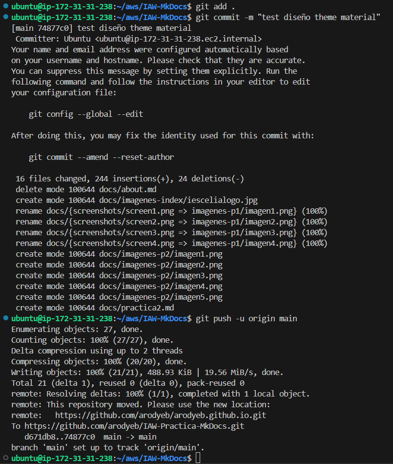
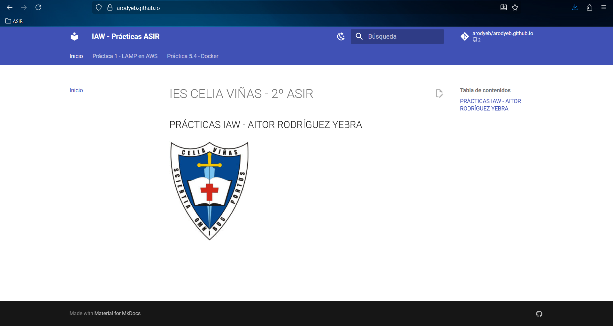
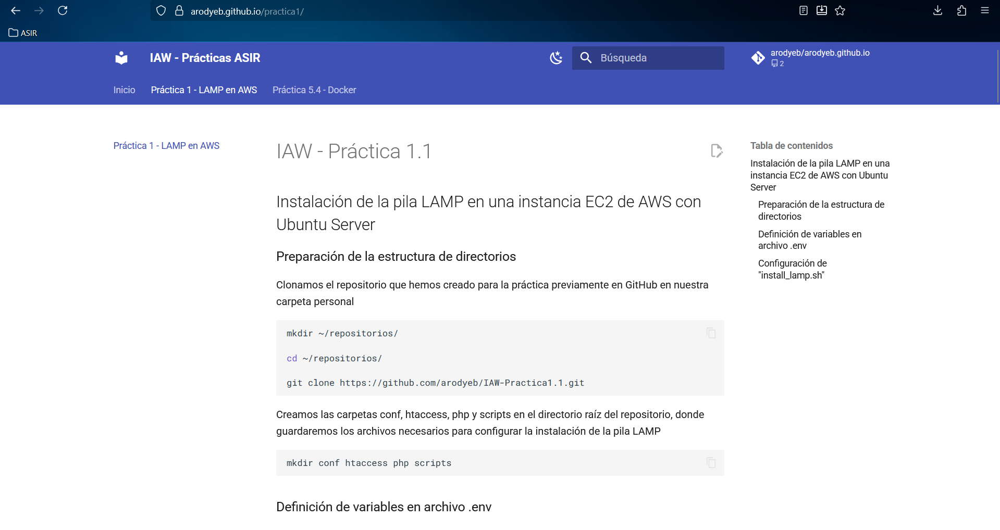
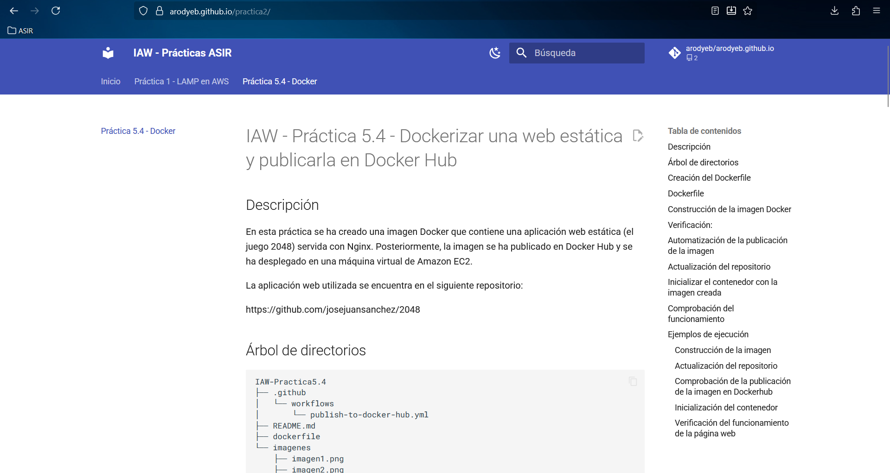

# IAW-Practica-MkDocs

## Descripción

En esta práctica se ha realizado la creación y publicación de un sitio web estático utilizando:

- MkDocs como generador de documentación.

- Material for MkDocs como tema visual.

- Docker para ejecutar el entorno de construcción.

- GitHub Pages para la publicación del sitio.

- GitHub Actions para la automatización del despliegue (CI/CD).

## Árbol de directorios

```bash
IAW-MkDocs
├── .github
│   └── workflows
│      └── build-push-mkdocs.yml
├── docs
│   ├── imagenes-index
│   │   └── iescelialogo.jpg
│   ├── imagenes-p1
│   │   ├── imagen1.png
│   │   ├── imagen2.png
│   │   ├── imagen3.png
│   │   └── imagen4.png
│   ├── imagenes-p2
│   │   ├── imagen1.png
│   │   ├── imagen2.png
│   │   ├── imagen3.png
│   │   ├── imagen4.png
│   │   └── imagen5.png
│   ├── index.md
│   ├── practica1.md
│   └── practica2.md
├── imagenes
│   ├── imagen1.png
│   ├── imagen2.png
│   ├── imagen3.png
│   └── imagen4.png
├── .gitignore
├── mkdocs.yml
└── README.md
```

## Uso de Docker con MkDocs

Para evitar instalaciones locales y problemas de dependencias, se utiliza la imagen oficial:

```bash
squidfunk/mkdocs-material
```

Esta imagen permite ejecutar los siguientes comandos:

- new → Crear un proyecto

- serve → Servidor local

- build → Generar sitio HTML

- gh-deploy → Publicar en GitHub Pages

### Crear un nuevo proyecto

Desde el directorio del proyecto:

```bash
docker run --rm -it -p 8000:8000 \
-u $(id -u):$(id -g) \
-v "$PWD":/docs \
squidfunk/mkdocs-material new .
```

Se generará la siguiente estructura:

```bash
proyecto/
├── docs/
│   └── index.md
└── mkdocs.yml
```

### Añadir contenido en Markdown

Todos los archivos .md deben estar dentro del directorio docs.

Ejemplo:

```bash
proyecto/
├── docs/
│   ├── index.md
│   └── about.md
└── mkdocs.yml
```

### Archivo de configuración mkdocs.yml

Ejemplo:

```YAML
site_name: IAW

nav:
  - Principal: index.md
  - Acerca de: about.md

theme: material
```

Permite configurar:

- Nombre del sitio

- Menú de navegación

- Theme

- Idioma

- Colores

- Plugins

- Funcionalidades extra

### Servidor de desarrollo

Para iniciar el servidor local:

```bash
docker run --rm -it -p 8000:8000 \
-u $(id -u):$(id -g) \
-v "$PWD":/docs \
squidfunk/mkdocs-material
```

Acceder desde el navegador a:

```
http://localhost:8000
```

El sitio se actualiza automáticamente al modificar los archivos Markdown.

### Personalización del theme

Material permite:

- Cambiar colores

- Cambiar tipografía

- Configurar idioma

- Añadir logo

- Configurar navegación

- Añadir repositorio Git

- Configurar Google Analytics

- Añadir comentarios (Disqus)

- Versionado de documentación

### Generar el sitio (build)

Para generar el HTML sin servidor:

```bash
docker run --rm -it \
-u $(id -u):$(id -g) \
-v "$PWD":/docs \
squidfunk/mkdocs-material build
```

Se generará el directorio:

```
site/
```

Este contiene el sitio web estático listo para producción.

### Publicar manualmente en GitHub Pages

```bash
docker run --rm -it \
-v ~/.ssh:/root/.ssh \
-v "$PWD":/docs \
squidfunk/mkdocs-material gh-deploy
```

Esto crea/actualiza la rama:

```
gh-pages
```

## Automatización con GitHub Actions (CI/CD)

Para automatizar el despliegue se ha creado un workflow en:

```
.github/workflows/build-push-mkdocs.yaml
```

Este workflow:

- Se ejecuta tras un push a main.

- Clona el repositorio.

- Instala Python.

- Instala MkDocs y mkdocs-material.

- Ejecuta mkdocs build.

- Publica el contenido en la rama gh-pages.

### Permisos del workflow

Para que el workflow pueda publicar en gh-pages:

- Ir a Settings

- Ir a Actions → General

- En Workflow permissions

- Seleccionar Read and write permissions

## Resultado final

Después de ejecutar el workflow:

- Rama main → Contiene los archivos Markdown y configuración.

- Rama gh-pages → Contiene el sitio web generado en HTML.

- El sitio queda publicado automáticamente en GitHub Pages.

## Ejemplos de ejecución

### Actualización del repositorio



### Comprobación del funcionamiento del sitio web



### Práctica 1



### Práctica 2

