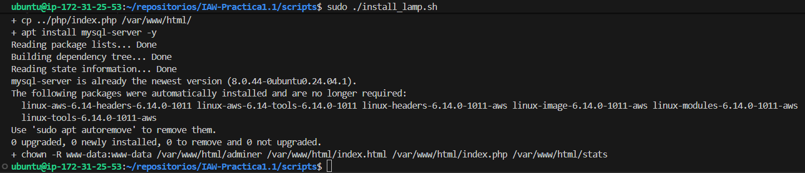

# IAW - Práctica 1.1

## Instalación de la pila LAMP en una instancia EC2 de AWS con Ubuntu Server

### Preparación de la estructura de directorios

Clonamos el repositorio que hemos creado para la práctica previamente en GitHub en nuestra carpeta personal

```bash
mkdir ~/repositorios/

cd ~/repositorios/

git clone https://github.com/arodyeb/IAW-Practica1.1.git
```

Creamos las carpetas conf, htaccess, php y scripts en el directorio raíz del repositorio, donde guardaremos los archivos necesarios para configurar la instalación de la pila LAMP

```bash
mkdir conf htaccess php scripts
```

### Definición de variables en archivo .env

Es necesario crear un archivo .env en el directorio de scripts con valores para una serie de variables que serán usadas posteriormente por los scripts de instalación.  
Para evitar compartir el valor de dichas variables y que sea personalizable, en su lugar se comparte un archivo como plantilla que se ha de personalizar y renombrar.  

### Configuración de "install_lamp.sh"

En la carpeta de scripts, creamos el archivo "install_lamp.sh"

```bash
cd scripts/
sudo nano install_lamp.sh
```

Configuramos el script para que se detenga si ocurre algún error y además muestre los comandos por pantalla

```bash
#!/bin/bash

set -ex
```

Actualizamos repositorios

```bash
apt update

apt upgrade -y
```

Instalamos Apache, habilitamos el módulo rewrite y copiamos el archivo de configuración personalizado

```bash
apt install apache2 -y

a2enmod rewrite

cp ../conf/000-default.conf /etc/apache2/sites-available
```

Instalamos PHP, el módulo de ejecución de scripts PHP de Apache y la extensión de conexión entre PHP y MySQL

```bash
apt install php libapache2-mod-php php-mysql -y
```

Reiniciamos Apache para llevar a cabo los cambios y copiamos el archivo index

```bash
systemctl restart apache2

cp ../php/index.php /var/www/html/
```

Instalamos MySQL y damos permisos sobre los archivos del sitio web al usuario y grupo de Apache  

```bash
apt install mysql-server -y

chown -R www-data:www-data /var/www/html/*
```

Instalamos MySQL y damos permisos sobre los archivos del sitio web al usuario y grupo de Apache

```bash
apt install mysql-server -y

chown -R www-data:www-data /var/www/html/*
```

El contenido del script debe ser tal que así:  
```bash
#!/bin/bash

#Configuramos el script para que se detenga si ocurre algún error y además muestre los comandos por pantalla

set -ex

#Actualizamos repositorios

apt update

apt upgrade -y

#Instalamos Apache, habilitamos el módulo rewrite y copiamos el archivo de configuración personalizado

apt install apache2 -y

a2enmod rewrite

cp ../conf/000-default.conf /etc/apache2/sites-available

#Instalamos PHP, el módulo de ejecución de scripts PHP de Apache y la extensión de conexión entre PHP y MySQL

apt install php libapache2-mod-php php-mysql -y

#Reiniciamos Apache para llevar a cabo los cambios y copiamos el archivo index

systemctl restart apache2

cp ../php/index.php /var/www/html/

#Instalamos MySQL y damos permisos sobre los archivos del sitio web al usuario y grupo de Apache  

apt install mysql-server -y

chown -R www-data:www-data /var/www/html/*

#Instalamos MySQL y damos permisos sobre los archivos del sitio web al usuario y grupo de Apache

apt install mysql-server -y

chown -R www-data:www-data /var/www/html/*
```
Al guardar el script de instalación de la pila LAMP, le damos permisos de ejecución:
```bash
sudo chmod +x install_lamp.sh
```
Creamos un archivo .env:
```bash
sudo nano .env
```
En este archivo se deben personalizar una serie de variables a las que luego se hará referencia en otro script:
```
PHPMYADMIN_APP_PASSWORD=tu_password_phpmyadmin
DB_NAME=nombre_base
DB_USER=usuario_base
DB_PASSWORD=password_base
STATS_USERNAME=usuario_stats
STATS_PASSWORD=password_stats
home=/home/tu_usuario
```
Creamos el script "install_tools.sh":
```bash
sudo nano install_tools.sh
```
Configuramos el script:
```bash
#!/bin/bash

# Configuramos el script para que se detenga si ocurre algún error y además muestre los comandos por pantalla

set -ex

# Importamos el archivo .env

source .env

# Configuramos las respuestas de la instalación de phpmyadmin

echo "phpmyadmin phpmyadmin/reconfigure-webserver multiselect apache2" | debconf-set-selections

echo "phpmyadmin phpmyadmin/dbconfig-install boolean true" | debconf-set-selections

echo "phpmyadmin phpmyadmin/mysql/app-pass password $PHPMYADMIN_APP_PASSWORD" | debconf-set-selections

echo "phpmyadmin phpmyadmin/app-password-confirm password $PHPMYADMIN_APP_PASSWORD" | debconf-set-selections

# Actualizamos repositorios

apt update

# Instalamos phpmyadmin

sudo apt install phpmyadmin php-mbstring php-zip php-gd php-json php-curl -y

# Creamos una carpeta para AdMiner y lo instalamos

mkdir -p /var/www/html/adminer

wget https://github.com/vrana/adminer/releases/download/v5.4.1/adminer-5.4.1-mysql.php -P /var/www/html/adminer/

mv /var/www/html/adminer/adminer-5.4.1-mysql.php /var/www/html/adminer/index.php


# Creamos una base de datos para comprobar que funciona

mysql -u root -e "DROP  DATABASE IF EXISTS $DB_NAME"

mysql -u root -e "CREATE DATABASE $DB_NAME"

# Creamos un usuario

mysql -u root -e "DROP USER IF EXISTS $DB_USER@'%';"

mysql -u root -e "CREATE USER '$DB_USER'@'%' IDENTIFIED BY '$DB_PASSWORD';"

# Damos permisos al usuario sobre la base de datos

mysql -u root -e "GRANT ALL PRIVILEGES ON $DB_NAME.* TO $DB_USER@'%';"

# Instalamos GoAccess

sudo apt install goaccess -y

# Creamos la carpeta stats en el directorio de Apache

mkdir -p /var/www/html/stats

# Creamos la carpeta htaccess en el home del usuario

mkdir -p $home/htaccess

goaccess /var/log/apache2/access.log -o /var/www/html/stats/index.html --log-format=COMBINED --real-time-html --daemonize

cp ../conf/000-default-stats.conf /etc/apache2/sites-available/000-default.conf

sudo htpasswd -bc /etc/apache2/.htpasswd $STATS_USERNAME $STATS_PASSWORD

# Copiamos el archivo htaccess

cp ../htaccess/.htaccess /var/www/html/stats

# Y reiniciamos Apache

systemctl restart apache2
```
Al terminar de configurar el script, guardamos los cambios y le damos permisos de ejecución:
```bash
sudo chmod +x install_tools.sh
```
Una vez configurados los scripts de instalación, ejecutar primero el script de la pila Lamp
```bash
sudo ./install_lamp.sh
```



Y una vez comprobado que el script se ha ejecutado correctamente, ejecutamos el script de herramientas y comprobamos que también se haga sin errores
```bash
sudo ./install_tools.sh
```

