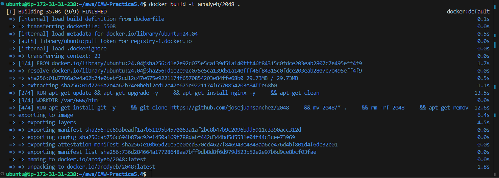

# IAW - Práctica 5.4 - Dockerizar una web estática y publicarla en Docker Hub

## Descripción

En esta práctica se ha creado una imagen Docker que contiene una aplicación web estática (el juego 2048) servida con Nginx. Posteriormente, la imagen se ha publicado en Docker Hub y se ha desplegado en una máquina virtual de Amazon EC2.

La aplicación web utilizada se encuentra en el siguiente repositorio:

https://github.com/josejuansanchez/2048

## Árbol de directorios

```bash
IAW-Practica5.4
├── .github
│   └── workflows
│       └── publish-to-docker-hub.yml
├── README.md
├── dockerfile
└── imagenes
    ├── imagen1.png
    ├── imagen2.png
    ├── imagen3.png
    ├── imagen4.png
    └── imagen5.png
```

## Creación del Dockerfile

Se creó un archivo llamado Dockerfile con los siguientes requisitos:

- Imagen base: ubuntu:latest

- Instalación de:

  - nginx

  - git

- Clonación del repositorio en /var/www/html

- Exposición del puerto 80

- Ejecución de Nginx en primer plano

## Dockerfile

```
#Capa base 
FROM ubuntu:24.04

#Actualizamos los paquetes
RUN apt-get update && apt-get upgrade -y \
    && apt-get install nginx -y \
    && apt-get clean

#Configuramos el directorio de trabajos
WORKDIR /var/www/html

#Clonamos el repositorio de la aplicación
RUN apt-get install git -y \
    && git clone https://github.com/josejuansanchez/2048 \
    && mv 2048/* . \
    && rm -rf 2048 \
    && apt-get remove git -y \
    && apt-get clean
#Definimos el entrypoint
ENTRYPOINT ["nginx", "-g", "daemon off;"]
```

## Construcción de la imagen Docker

Se ejecutó el siguiente comando (para publicar imágenes de particulares, no oficiales, es necesario añadir el nombre de usuario de la cuenta de Dockerhub al nombre de la imagen):

```bash
docker build -t arodyeb/2048 .
```

## Verificación:

```
docker images
```

## Automatización de la publicación de la imagen

Para que Github pueda publicar la imagen en Dockerhub es necesario configurar en el apartado secrets del repositorio tanto el username como el token de acceso de la cuenta de Dockerhub.

## Actualización del repositorio

Ejecutar los comandos para actualizar el repositorio de Github

```bash
git add .
git commit -m "mensaje"
git push -u origin main
```

## Inicializar el contenedor con la imagen creada

```bash
docker run -d -p 80:80 arodyeb/2048:latest
```

## Comprobación del funcionamiento

Se accedió desde el navegador a:

http://IP_PUBLICA

Si la configuración es correcta, se mostrará el juego 2048 funcionando.

## Ejemplos de ejecución

### Construcción de la imagen


### Actualización del repositorio


### Comprobación de la publicación de la imagen en Dockerhub



### Inicialización del contenedor


### Verificación del funcionamiento de la página web

